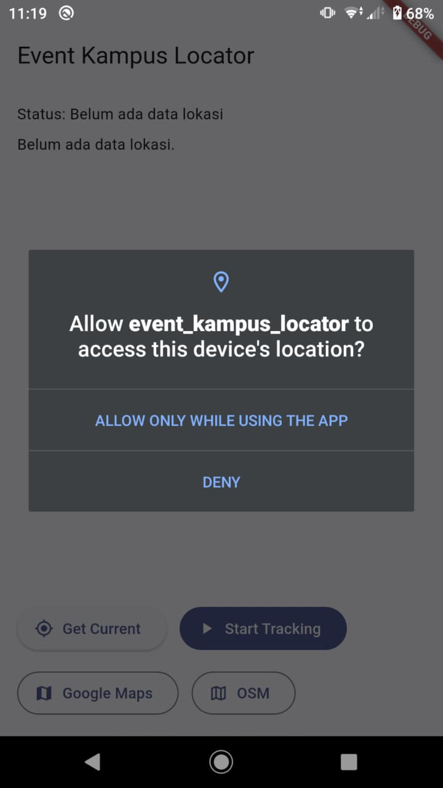
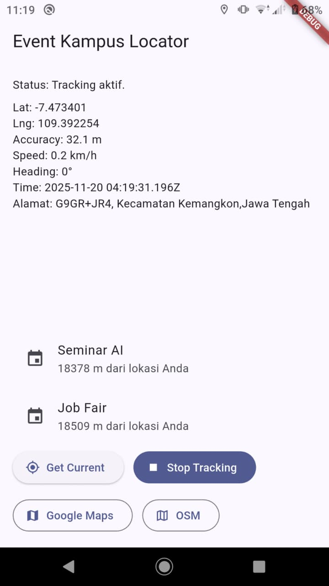
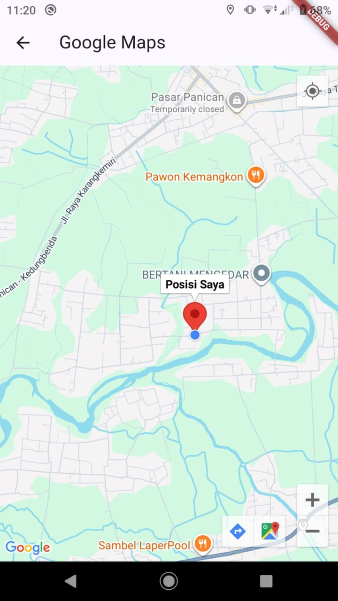
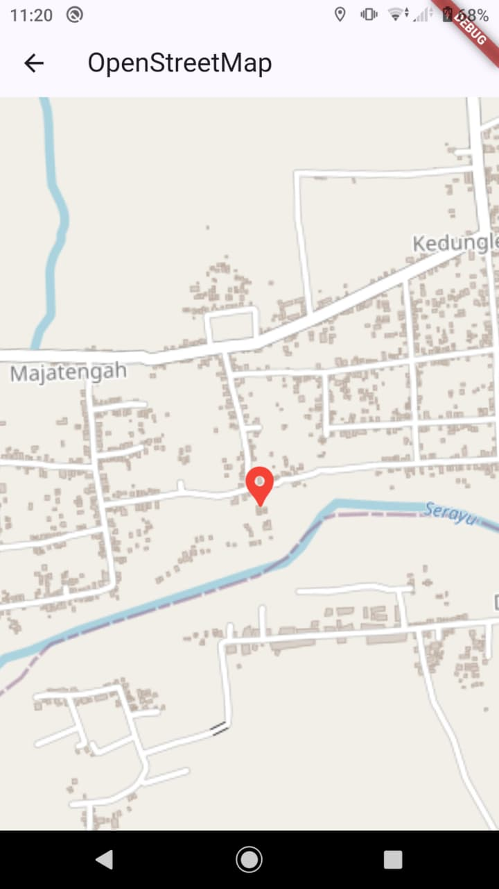
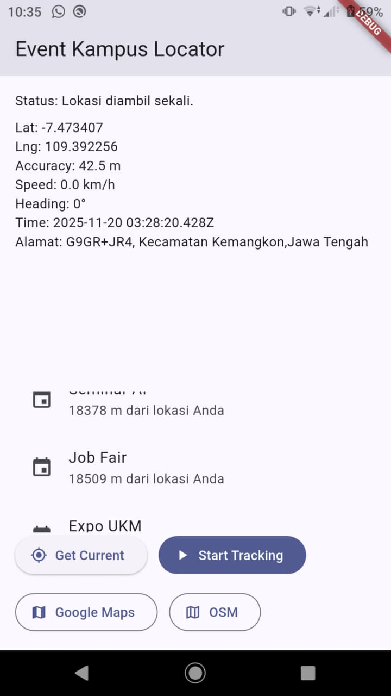

# 📰 Event Kampus Locator (Build 1)

**Nama:** Andrean Syah Putra  
**NIM:** STI202303719  
**Proyek:** Event Kampus Locator  
**Modul W11–12:** Flutter – Servis Lokasi, Peta (Google Maps & OSM)

---

## 1. 📍 Deteksi Lokasi & Alamat (Basic Location)

Fitur untuk mendapatkan lokasi pengguna **sekali ambil (one-time)** berupa _latitude_ dan _longitude_, lalu mengubahnya menjadi **alamat lengkap** menggunakan _Reverse Geocoding_. Tampilan menggunakan mode standar aplikasi.

   
  <em>Gambar 1. Tampilan Izin Lokasi</em>

   
  <em>Gambar 2. Tampilan Info Lokasi & Alamat</em>

---

## 2. 📡 Pelacakan & Navigasi (Tracking Stream)

Fitur pelacakan lokasi secara **real-time**, memperbarui koordinat saat pengguna bergerak.  
Dilengkapi tombol navigasi untuk membuka lokasi di **Google Maps** atau **OpenStreetMap (OSM)**.

   
  <em>Gambar 3. Mode Tracking & Tombol Navigasi</em>

   
  <em>Gambar 4. Tampilan Lokasi Perangkat (Google Maps)</em>

   
  <em>Gambar 5. Tampilan Lokasi Perangkat (OSM)</em>

---

## 3. 📝 Daftar Event Sederhana (Distance Calculation)

Menampilkan daftar event kampus dan menghitung jarak masing-masing event dari posisi pengguna secara otomatis.

   
  <em>Gambar 6. Daftar Event dengan Jarak</em>

---

## 📦 Teknologi yang Digunakan

- Flutter (Dart)
- Geolocator (Location Services)
- Geocoding (Reverse Geocode)
- Google Maps URL Launcher
- OpenStreetMap URL Navigator

---

## 🚀 Build 1 – Status

✔️ Lokasi  
✔️ Reverse Geocoding  
✔️ Tracking Stream  
✔️ Navigasi Maps  
✔️ Perhitungan Jarak Event

---
